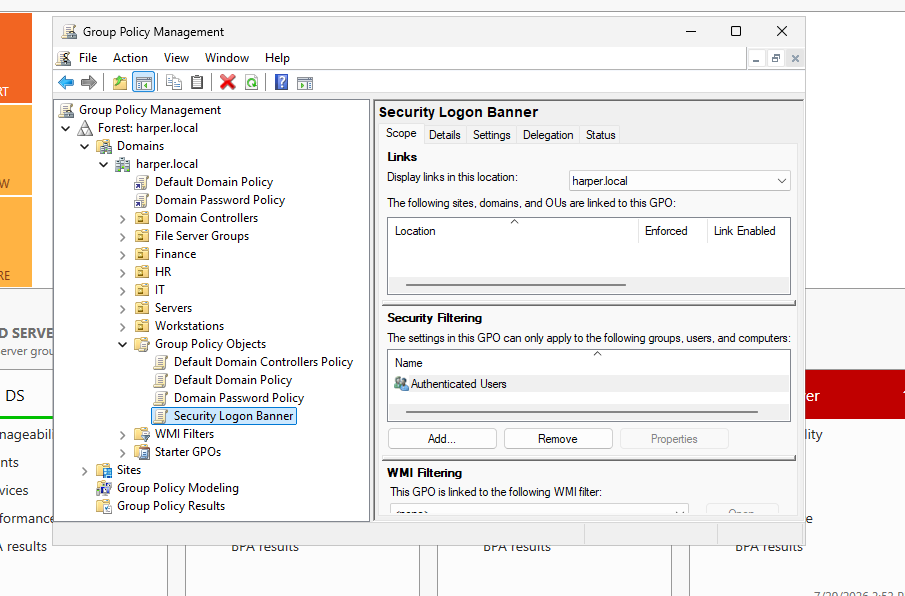
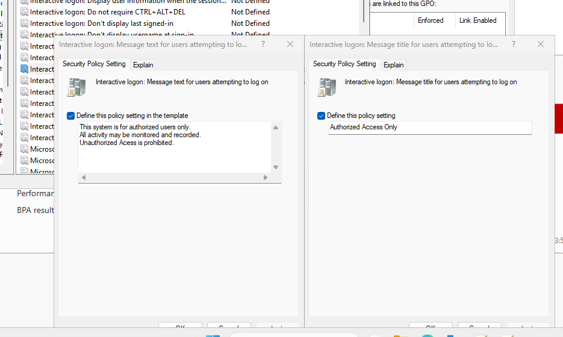

# Creating and Configuring a Group Policy Object

## Overview

Group Policy Objects (GPOs) allow administrators to centrally configure settings for users and computers within an Active Directory domain.

In this section, a new Group Policy Object was created using the Group Policy Management Console on the Windows Server 2025 Domain Controller.

## Creating the GPO

A new GPO was created with the following name:

`Security Logon Banner`




This GPO will be used to configure an interactive logon message that displays security information before users sign in.

## Configuration Path

The policy setting is configured under:

```
Computer Configuration
└── Policies
    └── Windows Settings
        └── Security Settings
            └── Local Policies
                └── Security Options
```
  


## Purpose of the Policy

An interactive logon banner is commonly used in organizations to provide authorized-use notifications before users access company systems.

Examples of information included in a logon banner:

* Authorized users only
* Monitoring and auditing notice
* Acceptable use requirements
* Security warnings

## Screenshots
### Created Logon Banner  
[](https://github.com/HarperSec/Group-Policy-Management-Lab/blob/main/screenshots/02-Security-Logon-Banner-GPO-Created.png)
### Policy Configuration  
[](https://github.com/HarperSec/Group-Policy-Management-Lab/blob/main/screenshots/03-Logon-Banner-Policy-Configuration.png)
